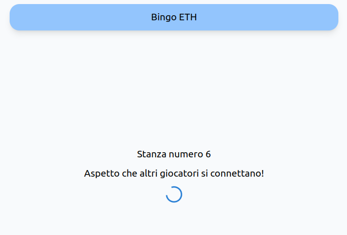
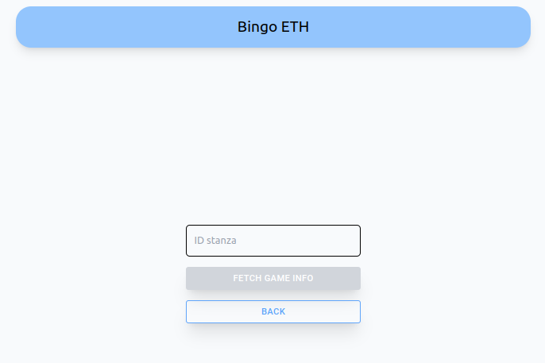
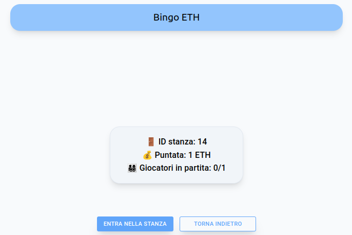
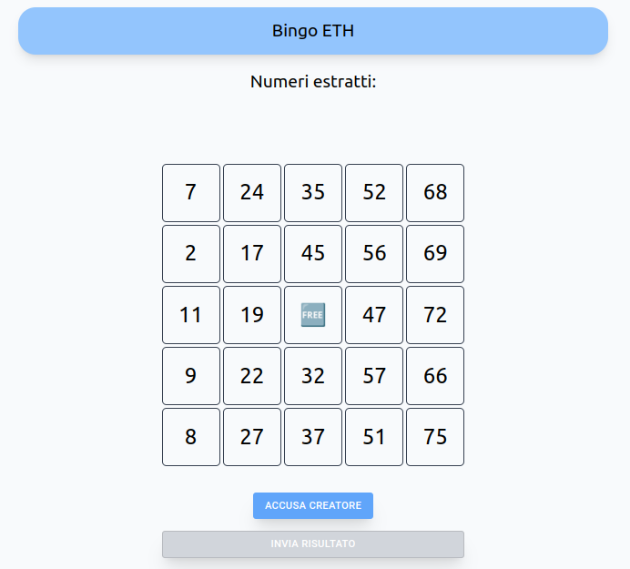

---
author:
    - "Leonardo Manneschi"
    - "Leonardo Scoppitto"
classoption: a4paper
documentclass: article
fontsize: 11pt
geometry: "left=2cm,right=2cm,top=2cm,bottom=2cm"
output:
    pdf_document:
        latex_engine: xelatex
title: BingoEth
subtitle: Relazione progetto P2P
header-includes: |
    \usepackage{dirtree}

---
\pagenumbering{gobble}
\hypersetup{linkcolor=cyan}

\pagebreak
\renewcommand{\contentsname}{Indice}
\tableofcontents
\pagebreak
\pagenumbering{arabic}
\setcounter{page}{1}

# Introduzione

L'applicazione sviluppata come progetto finale del corso di Peer To Peer & Blockchains si chiama BingoEth e si tratta di un'implementazione del bingo (la versione più famosa del bingo, quella americana da 75 numeri) realizzata in React/javascript per la parte di front-end e in Solidity per la parte di smart contract. È possibile consultare il repository su [GitHub](https://github.com/leomanne/P2P_Project.git).

# Struttura del progetto

Il progetto è stato organizzato come segue:

\dirtree{%
.1 client $\rightarrow$ \small{Codice del client scritto in React}.
.1 docs $\rightarrow$ \small{Directory contenente la relazione del progetto}.
.1 truffle $\rightarrow$ \small{Root del progetto dello smart contract}.
.2 contracts.
.3 Bingo.sol $\rightarrow$ \small{Sorgente del contratto}.
.2 migrations.
.3 1\_deploy\_contract.js $\rightarrow$ \small{Script di deploy del contratto}.
.1 Dockerfile/docker-compose.yml $\rightarrow$ \small{Container docker per il test e il deploy}.
}

# Funzionamento del progetto

## Lato front-end

Il front-end dell'applicazione BingoEth è sviluppato in React e consente agli utenti di interagire con il contratto smart su Ethereum per giocare a bingo. Le principali funzionalità del front-end includono:

- Creazione di una nuova partita scegliendo il numero massimo di giocatori e la cifra da scommettere.
- Partecipazione a una partita esistente facendo una join accettando o meno la cifra da scommettere.
- Visualizzazione dello stato del gioco in tempo reale.


Appena entrati nella nostra Dapp raggiungeremo la schermata principale (Figura 1) dalla quale potremo fare principalmente due cose:

- creare una nuova partita.
- unirci ad una partita casuale o specifica.

{ width=50% }


### Creazione partita


Per creare la stanza (Figura 2) è necessario inserire il numero massimo di giocatori e l'importo della scommessa per partecipare. Questi due valori abbiamo deciso debbano essere (per semplicità) interi. Una volta inseriti i dati, il pulsante `Scommetti` si abiliterà e, premendolo, verrà chiamata la funzione del contratto `createGame` di cui parleremo nel prossimo capitolo.

{ width=50% }


Solo dopo aver premuto il pulsante scommetti ci verra mostrata la schermata di attesa (Figura 3), in cui attenderemo di aver raggiunto il numero totale di utenti che abbiamo scelto precedentemente.

{ width=50% }

**Nota Bene:** il numero di giocatori specificato NON comprende il creatore del gioco, quindi se si specificherà un numero $n$ di giocatori, la partita si svolgerà fra $n+1$ giocatori.

### Entrare in una stanza

Per accedere a una stanza abbiamo due opzioni:

- scegliere una stanza random
- scegliere una stanza specifica, sapendo l'ID della stanza


Se cliccato il pulsante `Entra in una stanza` ci si aprira una schermata (Figura 4) in cui dobbiamo obbligatoriamente inserire un ID per selezionare il gioco a vogliamo partecipare.


{ width=50% }


Se l'ID selezionato risulta essere corretto e ci sono ancora posti disponibili allora apparirà la schermata contenente (Figura 5):

- ID della stanza scelta
- Gli Eth da scommettere per poter unirsi alla camera
- Il numero di posti disponibili

{ width=50% }


A questo punto se viene cliccato il pulsante `Entra nella stanza` L'ETH scommesso verra prelevato e il numero dei giocatori verra aggiornato attraverso la chiamata di funzione del contratto `JoinGame` di cui parleremo nel prossimo capitolo.

Cliccando invece sul pulsante `Entra in una stanza random`, si andranno a richiedere le informazioni su un gioco scelto casualmente dal contratto, al quale potremo poi decidere se accedere o meno (Figura 5).

### Fase di gioco

Una volta che tutti i giocatori sono entrati si avvia la partita e verrà caricata la cartella creata dal client al momento dell'ingresso nella stanza (parleremo meglio di questo argomento nel capitolo sulla sicurezza).

#### Lato Creatore della stanza


Come detto in precedenza solo il creatore delle stanze si prende carico della responsabilita di chiedere l'estrazione dei numeri al contratto e come tale è in una posizione di comando rispetto agli altri joiners. Vediamo la schermata di gioco (Figura 6):

{ width=50% }

Come si vede dall'immagine (Figura 6) abbiamo:

- La lista dei valori estratti da 1 a 75.
- la tabella contenente i numeri scelti casualmente lato client. Abbiamo rimosso la possibilità di scelta dei numeri per evitare possibili problemi di imbrogli dai giocatori. Sarà cura dei giocatori selezionare la casella corretta, come nel vero gioco.
- Un pulsante per estrarre i numeri, chiamando la funzione `extractNumber` del contratto.
- Un pulsante per inviare la propria combinazione vincente al contratto quando si ha fatto bingo. Il pulsante si abilita solo se effettivamente sono state selezionate le casella appartenenti a una combinazione vincente. Questa scelta lato client è stata presa per evitare lo spam di richieste al contratto.

#### Lato Joiner della stanza


Dato che solo il creatore del gioco può estrarre i numeri, abbiamo dato ai joiner della stanza la possibilità di denunciarlo se cerca di bloccare il gioco per far allontanare i giocatori. Per questo motivo, è stato aggiunto un pulsante `Accusa`. Se premuto, questo pulsante rimuove il creatore dalla partita dopo un certo numero di secondi, terminando il gioco.

{ width=50% }


Altre possibili implementazioni avrebbero potuto includere una logica che trasformava chi denunciava nel nuovo creatore. Tuttavia, abbiamo optato per una soluzione più semplice. Se la denuncia viene confermata, il creatore dovrà estrarre un numero entro un certo limite di tempo. Se lo fa, il gioco prosegue normalmente; altrimenti, tutti i giocatori riceveranno indietro il proprio denaro, insieme alla puntata del creatore, che verrà divisa per tutti i giocatori.


{ width=50% }

## Lato smart contract

Lo smart contract è scritto in Solidity e gestisce la logica del gioco, inclusa la gestione dei numeri estratti, la verifica delle cartelle dei giocatori e la distribuzione dei premi. Il contratto include le seguenti funzionalità:

- Creazione di una nuova partita e gestione dell'unione dei players alle partite.
- Gestione dei numeri estratti per ogni partita.
- Verifica delle vincite.
- Distribuzione dei premi.

Sotto vediamo i codici per queste funzionalita:

### Funzione `createGame`

La funzione `createGame` viene chiamata per avviare una nuova partita. Verifica i parametri di input come il numero massimo di giocatori consentiti e l'ammontare della scommessa. Successivamente, genera un ID univoco per la partita e inizializza un nuovo oggetto di gioco nella lista. Vengono impostati vari parametri, tra cui il creatore della partita, l'ammontare della scommessa, il merkle root delle carte del creatore, eccetera. Infine, aggiunge la partita alla lista dei giochi disponibili e emette un evento per segnalare la creazione della partita.

```java
function createGame(uint _maxJoiners, uint _betAmount, bytes32 _cardMerkleRoot)
public payable {
    // Requisiti di input
    require(_maxJoiners > 0, "Max joiners must be greater than 0");
    require(_betAmount > 0, "Bet amount must be greater than 0");
    require(msg.sender.balance/1 ether >= _betAmount,
        "Cannot bet more than you can afford!");
    require(msg.value == _betAmount*1 ether,
        "Please send exactly the amount you want to bet!");

    // Generazione dell'ID del gioco
    int256 gameId = getGameId();

    // Creazione di una nuova istanza di gioco
    Info storage newGame = gameList[gameId];

    // Inizializzazione dei parametri del gioco
    newGame.creator = msg.sender;
    newGame.joiners = new address ;
    newGame.maxJoiners = _maxJoiners;
    newGame.totalJoiners = 0;
    newGame.ethBalance = 0;
    newGame.betAmount = _betAmount;
    newGame.creatorMerkleRoot = _cardMerkleRoot;
    newGame.accusationTime = 0;
    newGame.accuser = address(0);

    // Inizializzazione del mapping per il merkle root del creatore
    newGame.joinerMerkleRoots[msg.sender] = 0;

    // Aggiunta del gioco alla lista dei giochi disponibili
    elencoGiochiDisponibili.push(gameId);

    // Aggiunta del valore del betAmount all'ethBalance del gioco
    newGame.ethBalance += _betAmount;

    // Emit dell'evento GameCreated
    emit GameCreated(
        gameId,
        newGame.maxJoiners,
        newGame.totalJoiners
    );
}
```

### Funzione `extractNumber`

La funzione `extractNumber` gestisce l'estrazione dei numeri nel gioco utilizzando una funzione per generare numeri casuali, facendo un check per evitare di estrarre numeri duplicati. Aggiunge quindi il numero estratto alla lista dei numeri estratti per il gioco corrispondente. Se specificato, resetta l'accusa e l'accusatore nel gioco. Infine, emette eventi per informare sul numero estratto o segnalare la fine del gioco se tutti i numeri sono stati estratti.

```java
function extractNumber(int256 _gameId, bool accused) public {
    // Controlla se tutti i numeri sono stati estratti
    require(gameList[_gameId].numbersExtracted.length <= 75,
        "All numbers have been extracted!");

    // Genera un nuovo numero per il gioco
    uint8 newNumber = getNewNumber(_gameId);
    int8 i = 1;

    // Controlla se il numero è già stato estratto,
        in tal caso genera un nuovo numero
    while (isExtracted(gameList[_gameId].numbersExtracted, newNumber)) {
        newNumber = getNewNumber(_gameId+i);
        i++;
    }

    // Aggiunge il nuovo numero alla lista dei numeri estratti per il gioco
    gameList[_gameId].numbersExtracted.push(newNumber);

    // Reset dell'accusa se il parametro accused è true
    if(accused){
        gameList[_gameId].accusationTime = 0;
        gameList[_gameId].accuser = address(0);
    }

    // Controlla se tutti i numeri sono stati estratti e emette eventi di conseguenza
    if(gameList[_gameId].numbersExtracted.length < 75){
        emit NumberExtracted(_gameId, newNumber, false);
    }else{
        emit GameEnded(_gameId, gameList[_gameId].creator,
            gameList[_gameId].ethBalance, WinningReasons.BINGO);
    }
}
```

# Principali decisioni

## Struttura dati

Per salvare tutte le informazioni sui dati riguardanti un game abbiamo scelto di optare per una struct, sotto il codice:

```java
struct Info {
        address creator;
        address[] joiners;
        uint maxJoiners;
        uint totalJoiners;
        uint ethBalance;
        uint betAmount;
        bytes32 creatorMerkleRoot;
        mapping(address => bytes32) joinerMerkleRoots;
        uint8[] numbersExtracted;
        uint accusationTime;
        address accuser;
    }
```

Come possiamo vedere, viene salvato l'address del creatore del game e di tutti i joiners, oltre che alle ovvie informazioni sul game come il tetto massimo di giocatori e il valore da scommettere in ethereum. Ci salviamo inoltre anche il MerkleRoot del creatore e di tutti i joiners attraverso un mapping.
Le ultime variabili sono utilizzate rispettivamente per il controllo sui numeri estratti e sull'accusa dei giocatori per il creatore del game che ha la responsabilità di estrarre i numeri del bingo.

## Vincoli e regole di **BingoEth**

I seguenti vincoli sono stati implementati per garantire il corretto funzionamento del gioco:

- **Numero delle caselle**: Il numero delle caselle è stato settato seguendo le regole base del bingo americano e quindi a 25 caselle totali.
- **La casella centrale**: La casella centrale è una casella jolly e quindi valida di base.
- **Il creatore**: Il creatore si assume il ruolo di chiedere al contratto di estrarre i numeri.
- **Limite scommesse**:  I giocatori non possono scommettere piu di 1000 ETH.
- **Numero di cartelle**: Per semplicità un giocatore può comprare una sola cartella alla volta.

## Uso di Merkle Tree

Abbiamo deciso di utilizzare un Merkle Tree per garantire l'integrità dei dati dei giocatori senza rivelare le informazioni sensibili durante la verifica delle vincite. Questo approccio consente una verifica efficiente e sicura delle cartelle di bingo.


### Generazione del Merkle Tree

Il codice per la generazione del Merkle Tree si trova all'interno del file `client/src/services/TableService.js` ed è implementato nella funzione `generateMerkleTree`.

**Funzionalità:**
- La funzione prende in input una tabella (`table`), rappresentata come un array.
- Ogni elemento della tabella viene convertito in un hash utilizzando `utils.soliditySha3` della liberia `web3`.
- Gli hash risultanti costituiscono il livello delle foglie (`leaves`) del Merkle Tree.
- Viene quindi calcolato il Merkle Tree iterativamente, concatenando e hashando le coppie di nodi fino a raggiungere la radice del Merkle Tree.

```javascript
export function generateMerkleTree(table) {
    console.log(table);
    let merkleTree = [];

    let tmp = [];
    for (const element of table) {
        tmp.push(utils.soliditySha3(element.toString()));
    }
    merkleTree.push(tmp);

    while (tmp.length > 1) {
        const nextLevel = [];
        for (let j = 0; j < tmp.length; j += 2) {
            if (tmp[j + 1]) {
                nextLevel.push(utils.soliditySha3((tmp[j] + tmp[j + 1].slice(2))));
            } else {
                nextLevel.push(utils.soliditySha3((tmp[j] + tmp[j].slice(2))));
            }
        }
        tmp = nextLevel;
        merkleTree.push(nextLevel);
    }
    return merkleTree;
}
```

Una particolarità del calcolo del merkle tree in questo contesto è che il numero di elementi nella cartella del bingo non è una potenza del 2, infatti viene considerato un array di 24 elementi (non includiamo la casella centrale essendo sempre valida) rappresentante la cartella del giocatore:


Come possiamo vedere dal diagramma, al livello $3$ l'elemento con indice $2$ viene duplicato per permettere il calcolo dell'elemento $(4,1)$.
Questa soluzione è di semplice implementazione, infatti, durante il calcolo del merkle tree, è sufficiente controllare all'interno del ciclo for se si ha un elemento successivo a quello corrente con cui eseguire l'hash, altrimenti si esegue l'hash *"raddoppiando"* il nodo corrente:

```javascript
for (let j = 0; j < tmp.length; j += 2) {
    if (tmp[j + 1]) {
        nextLevel.push(utils.soliditySha3((tmp[j] + tmp[j + 1].slice(2))));
    } else {
        nextLevel.push(utils.soliditySha3((tmp[j] + tmp[j].slice(2))));
    }
}
```

### Generazione della Merkle Proof

Così come nella generazione dell'albero, si deve prestare attenzione anche alla generazione delle proof. In caso di bingo, a seconda se la combinazione contiene o no la casella centrale, la proof consiste in un array contenente tanti array quanti sono i numeri estratti da verificare:

```javascript
const exampleProof = [
    [firstElement, elementIndex, H1, H2, H3, H4, H5],
        ...,
    [lastElement, elementIndex, H1, H2, H3, H4, H5]
]
```
La funzione generateMerkleProof prende in input la cartella `card` di 24 elementi e l'array `result` sempre di 24 elementi booleani, dove l'elemento `i` è `true` se l'elemento `i` della cartella fa parte di una combinazione vincente.

```javascript
export const generateMerkleProof = (card, result) => {
    const proofs = [];
    const mT = generateMerkleTree(card);
    const leaves = mT[0];
    for (let i = 0; i < result.length; i++) {
        if (!result[i]) {
            continue;
        }
        const elementHash = utils.soliditySha3(card[i].toString());
        const index = leaves.indexOf(elementHash);

        let proof = [];
        let currentIndex = index;

        proof.push(stringToBytes32(card[i].toString()));
        proof.push(stringToBytes32(i.toString()));

        for (let level = 0; level < mT.length - 1; level++) {
            const currentLevel = mT[level];
            const isRightNode = currentIndex % 2 === 1;
            const siblingIndex = isRightNode ? currentIndex - 1 : currentIndex + 1;

            if (siblingIndex < currentLevel.length) {
                proof.push(`${currentLevel[siblingIndex]}`);
            }

            currentIndex = Math.floor(currentIndex / 2);
        }
        if (index > 15) {
            let last = proof.pop();
            proof.push(
                `${mT[mT.length - 3][mT[mT.length - 3].length - 1]}`
            );
            proof.push(last);
        }
        proofs.push(proof);
    }
    return proofs;
};
```

Come possiamo vedere, dopo il ciclo for che va a calcolare gli hash da inserire nella proof, si va a controllare se l'indice dell'elemento di cui si sta calcolando la proof è maggiore di 15. Se è maggiore di 15, infatti si dovrà aggiungere l'hash $H_{3,2}$ in penultima posizione così che durante la verifica si tenga conto del *raddoppio* eseguito durante la generazione dell'albero.

Questa soluzione permette di verificare in modo classico una proof, la cui implementazione si trova all'interno del contratto:

```java
function verifyMerkleProof(
    bytes32 _root,
    string memory _leaf,
    bytes32[] memory _proof,
    uint256 _index
) internal pure returns (bool) {
    bytes32 _hash = keccak256(abi.encodePacked(_leaf));
    // Starting from 2 to avoid resizing the proof array
    for (uint256 i = 2; i < _proof.length; i++) {
        if (_index % 2 == 0) {
            _hash = keccak256(abi.encodePacked(_hash, _proof[i]));
        } else {
            _hash = keccak256(abi.encodePacked(_proof[i], _hash));
        }
        _index /= 2;
    }
    return _hash == _root;
}
```

#### Esempio 1
Se si deve verificare un elemento con indice minore o uguale a $15$, ad esempio $7$, la sua merkle proof sarà: $$[element, 7, H_{0,6}, H_{1,2}, H_{2,0}, H_{3,1}, H_{4,1} ]$$


#### Esempio 2
Se si deve verificare un elemento con indice maggiore di$15$, ad esempio $20$, la sua merkle proof sarà: $$[element, 20, H_{0,21}, H_{1,11}, H_{2,3}, H_{3,2}, H_{4,0} ]$$


# Manuale utente

## Utilizzo dell'istanza pubblica

Per rendere più fruibile l'utilizzo dell'applicazione sviluppata, è stato eseguito il deploy di **BingoEth** su un server privato insieme a un'istanza di Ganache, così da non dover configurare nulla se non la rete su Metamask. È possibile accedere al progetto all'url [https://bingoeth.alteregofiere.com/](https://bingoeth.alteregofiere.com/).

Gli account disponibili con le relative chiavi private sono:

```
Available Accounts
==================
(0) 0xC2F709C582CDe40CA38b108Fb0e639c14e108A8a (10000 ETH)
(1) 0x35301246031343A7d13507b19aa6d4fE40F6587c (10000 ETH)
(2) 0x97f4Ec285360456cb008B71B22cF1eFDd094e766 (10000 ETH)
(3) 0x0fac963Ae1E20De87294A627938da0f04d9eb78E (10000 ETH)
(4) 0x2b614F260BDD54FF6180543C9125A0e69679d04a (10000 ETH)
(5) 0x9307C2e5EB3e6935D6F35bFa13288BFc36aDd846 (10000 ETH)
(6) 0x7670F41114B30a6f06FD629707b193eCe545a59A (10000 ETH)
(7) 0x1923D74eAC7Fde59A9b08bAc5970350644cC2a90 (10000 ETH)
(8) 0xc0748B93286b8DC2D6C2736725413De61da4Bf56 (10000 ETH)
(9) 0xe50a5343693edd7F9c52ec66ff7358b5f18300B1 (10000 ETH)

Private Keys
==================
(0) 0x99409bd109959b84aae9234ce755a39a6df4c009a53c6a81ea0713d65bd80eb7
(1) 0x98d1ccd915ef23a2a088dfec9a47960f7de3b71d5f3c2aff53b7cb85e411adc5
(2) 0xe41c4f1aad19f7238246df7712f748c5cf4d6ac1c8a78e1b3aafb4a74e6ae39d
(3) 0x42941bc9871700dade0f40b607a8e0528fd9578dbefcf4abe6b4f4b2eea817b0
(4) 0x7a956b721714c8708ff22b25b193dae7efc7eaec77fe5b40c5c2944fc42feebe
(5) 0x9d19b8c0ad94ac66122485684d44bfa782dd84def2c2382b991f3632f3b9a294
(6) 0x8b93665547a073f7055c043ce4e6115a13e0900d18e23d206c9b0b17f8bf27e8
(7) 0x93c2d0ce2d1398fd5585c348a7befd000fecfebd0c9d5005550e820317ab0a47
(8) 0xd994441bc950b1d80191c8a0454a7b186a3562a8cf486390d4f740a713384d81
(9) 0x9f6e155cd2faf86bb96331732d9f5c6727fe0858773d7ad141f67425e7b1fe1b
```


## Esecuzione da sorgente

> *Nota: per l'utilizzo del progetto è consigliato avere docker (consultare [https://docs.docker.com/get-docker/](https://docs.docker.com/get-docker/)) installato sul proprio pc.*

Steps:

1. Clonare il repository da [https://github.com/leomanne/P2P_Project](https://github.com/leomanne/P2P_Project) o da [https://github.com/skiby7/BingoEth](https://github.com/skiby7/BingoEth) (il secondo repository è il mirror del primo) o scompattare l'archivio BingoEth.zip
2. Aprire il terminale/powershell e spostarsi dentro la directory del progetto
3. Eseguire il comando `docker compose up`

Eseguiti i passi indicati, inizierà il processo di build del container docker. Dopodiché si avvierà il container che compilerà il contratto, per poi avviare l'applicazione **BingoEth**.
Una volta terminato il processo di build, sarà possibile accedere all'applicazione tramite browser all'url [http://localhost:80](http://localhost:80).

Gli account verranno configurati su un'istanza di ganache locale all'indirizzo (`http://127.0.0.1:7545`).

# Valutazione del consumo di gas

<!-- - Il deploy del progetto si consuma una quantita di gas pari a 3653200 Gas
- La funzione CreateGame si consuma 179890 Gas
- La funzione JoinGame consuma 131088 Gas
- La sola funzione accuse consuma 67810 Gas
- La sola funzione di CheckAccuse consuma ~ 1300+(2500×n) Gas dove n = numero di joiners
- L'estrazione di un numero ~ 70705 Gas * un massimo di 75 numeri = massimo 5302875 Gas
- L'estrazione delle informazioni su un game ~ 36536 Gas
- Stima per la sottomissione di una board con SubmitBoard ~ 40181 Gas -->

|      Funzione      |   Gas Consumato  |                               Note                               |
|:------------------:|:----------------:|:----------------------------------------------------------------:|
|  Deploy contratto  |      3653200     |                                                                  |
|    `createGame`    |      179890      |                                                                  |
|     `joinGame`     |      131088      |                                                                  |
|      `accuse`      |       67810      |                                                                  |
|    `checkAccuse`   |  $1300+(2500\times n)$ |                  Dove $n$ è il numero di joiners                 |
|   `extractNumber`  | $70705 \times m$ | $m$ è il numero di tentativi (massimo 75, quindi 5302875 Gas)    |
|    `getInfoGame`   |       36536      |                                                                  |
|    `submitBoard`   |       40181      |                                                                  |

## Valutazione di esempio con un gioco con un creatore e 3 joiners

Ipotiziamo che ci siano stati 37 numeri per aver raggiunto il termine del gioco e che ci siano state 6 accuse (ovviamente non andate a buon fine). Calcoliamo il costo complessivo:

Per calcolare il costo complessivo del consumo di gas considerando le operazioni specificate, ipotizziamo i seguenti dati:

- **Creatore del gioco**: 1
- **Joiners**: 3
- **Numeri estratti**: 37
- **Accuse**: 6

### Calcolo del consumo di gas:

1. **Deploy del progetto**: 3653200 gas

2. **Creazione di un gioco**:
   - 179890 gas

3. **JoinGame** per 3 joiners:
   - 131088 * 3 = 393264 gas

4. **Accuse** per 6 accuse:
   - 67810 * 6 = 406860 gas

5. **CheckAccuse** per 6 accuse e 3 joiners:
   - Ogni chiamata a `CheckAccuse` con 3 joiners:
     - 1300 + (2500 * 3) = 1300 + 7500 = 8800 gas
   - 8800 * 6 = 52800 gas

6. **Estrazione di numeri**:
   - Numero massimo di estrazioni: 37
   - 70705 * 37 = 2616085 gas

7. **Estrazione delle informazioni su un gioco**:
   - 36536 gas (assumiamo 1 chiamata)

8. **Sottomissione della board con SubmitBoard**:
   - 40181 gas (al caso pessimo)

### Totale del consumo di gas:

Gas totale = 3653200 + 179890 + 393264 + 406860 + 52800 + 2616085 + 36536 + 40181

### Calcolo:

Gas totale = 7949016 + 52800 + 2616085 + 36536 + 40181
Gas totale = 7949016 + 2716902 + 40181
Gas totale = 10656099 + 40181
Gas totale = 10696280 gas

Quindi, il costo complessivo del consumo di gas per le operazioni descritte, considerando un creatore del gioco e 3 joiners, con 37 numeri estratti e 6 accuse, è di circa 10,696,280 gas.

Per calcolare quanto spende un joiner e quanto spende il creatore del gioco in base al consumo di gas specificato, consideriamo che i joiner possono eseguire tutte le operazioni elencate:

**Dati forniti:**
- Creatore del gioco: 1
- Joiners: 3
- Numeri estratti: 37
- Accuse: 6

**Consumo totale di gas:** 10,696,280 gas

### Calcolo del consumo di gas per ciascun partecipante:

#### Creatore del gioco:
1. **Deploy del progetto**: 3,653,200 gas
2. **Creazione di un gioco**: 179,890 gas
3. **JoinGame** per 3 joiners: 393,264 gas (si presume che il creatore del gioco non esegua JoinGame, quindi consideriamo solo il costo iniziale per la creazione)
4. **Accuse**: 406,860 gas
5. **CheckAccuse**: 52,800 gas (calcolato come 8800 gas per chiamata * 6 accuse)
6. **Estrazione di numeri**: 2,616,085 gas (37 estrazioni)
7. **Estrazione delle informazioni su un gioco**: 36,536 gas (1 chiamata)
8. **Sottomissione della board con SubmitBoard**: 40,181 gas (al caso pessimo)

**Totale per il creatore**:
\[
3653200 + 179890 + 393264 + 406860 + 52800 + 2616085 + 36536 + 40181 = 6763376 \text{ gas}
\]

#### Joiner:
1. **JoinGame**: 131,088 gas (per ciascuno dei 3 joiners)
2. **Accuse**: 67,810 gas (per ciascuna delle 6 accuse)
3. **CheckAccuse**: 52,800 gas (stesso costo totale del creatore, poiché coinvolto solo come partecipante)
4. **Estrazione delle informazioni su un gioco**: 36,536 gas (1 chiamata)
5. **Sottomissione della board con SubmitBoard**: 40,181 gas (al caso pessimo)

**Totale per un joiner**:
\[
131088 + 67810 + 52800 + 36536 + 40181 = 329815 \text{ gas}
\]

### Conclusione:

- **Creatore del gioco**: Spenderebbe circa **6,763,376 gas** per tutte le operazioni descritte.
- **Joiner**: Ogni joiner spenderebbe circa **329,815 gas** per le operazioni di JoinGame, Accuse, Estrazione delle informazioni su un gioco e Sottomissione della board con SubmitBoard.


# Potenziali vulnerabilità

La funzione utilizzata per generare numeri casuali in uno smart contract utilizza l'hashing di dati come il timestamp del blocco, la difficoltà del blocco, l'indirizzo del mittente e un seed fornito. Tuttavia, la sicurezza di questa implementazione merita attenzione. L'hashing di parametri come il timestamp e la difficoltà del blocco non è completamente imprevedibile e potrebbe essere influenzato da attacchi che manipolano questi valori, compromettendo la casualità dei numeri generati. Inoltre, la funzione itera per trovare un numero non ancora estratto, il che può aumentare il consumo di gas e causare ritardi se il numero di tentativi è elevato.

## Generazione di numeri casuali

```java
function extractNumber(int256 _gameId, bool accused) public {
        uint startGas = gasleft();
        require(gameList[_gameId].numbersExtracted.length <= 75,
            "All numbers have been extracted!");
        uint8 newNumber = getNewNumber(_gameId);
        int8 i = 1;
        while (isExtracted(gameList[_gameId].numbersExtracted, newNumber)) {
            newNumber = getNewNumber(_gameId+i);
            i++;
        }
        gameList[_gameId].numbersExtracted.push(newNumber);
        if(accused){
            gameList[_gameId].accusationTime = 0;
            gameList[_gameId].accuser = address(0);
            emit ConfirmRemovedAccuse(_gameId);

        }
        if(gameList[_gameId].numbersExtracted.length < 75){
            emit NumberExtracted(_gameId, newNumber,false);
        }else{
            emit GameEnded(_gameId, msg.sender,
                gameList[_gameId].ethBalance * 1 ether, 0, true, WinningReasons.BINGO);
            payable(msg.sender).transfer(gameList[_gameId].ethBalance * 1 ether);
        }
        gameList[_gameId].weiUsed += (startGas - gasleft()) * tx.gasprice;
    }


    function getNewNumber(int256 seed) internal view returns(uint8) {
        uint256 randomHash = uint256(keccak256(abi.encodePacked
            (block.timestamp, block.difficulty, msg.sender, seed)));
        uint256 randomNumber = (randomHash % 75) + 1;
        return uint8(randomNumber);
    }

```
La funzione `extractNumber` gestisce l'estrazione di numeri casuali per un gioco all'interno di un contratto intelligente. Inizia registrando il gas disponibile all'inizio dell'esecuzione. Verifica se il numero di numeri estratti per il gioco specificato è inferiore o uguale a 75. Se tutti i numeri sono stati estratti, interrompe l'esecuzione con un errore. Genera un nuovo numero casuale utilizzando la funzione `getNewNumber`. Verifica l'unicità del numero attraverso un ciclo while, incrementando un contatore in caso di collisione e ottenendo un nuovo numero fino a trovare uno unico. Aggiunge il numero estratto all'array del gioco. Se l'argomento accused è vero, reimposta l'accusa nel gioco. Emette eventi per segnalare l'estrazione di un numero o la fine del gioco. Infine, calcola e aggiorna i costi di gas utilizzati durante l'esecuzione della funzione.


